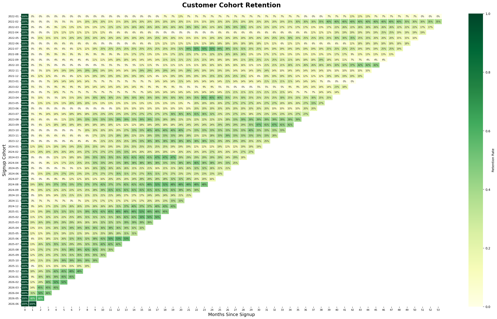

# SaaS Churn & Retention Analysis

**Author:** Piyush Kumar Jha

> **Two independent investigations into SaaS churn using different datasets and analytical methods, followed by a synthesis that recommends which finding the business should act on first.**
>
> Rather than presenting multiple analyses and leaving the decision to stakeholders, this project evaluates competing investigations and makes an evidence-based business recommendation.

**Tech Stack:** SQL · PostgreSQL · Python (Pandas, SciPy, Seaborn, Matplotlib) · Welch's t-test · Cohort Analysis · Feature Engineering · Stakeholder Communication

---

# Executive Recommendation

## 📌 If the business can only fund one initiative...

**Prioritize the Behavioral Churn Predictor Investigation.**

The analysis shows that customers become disengaged **weeks before they churn**. Simple behavioral signals such as **days since last activity** and **recent event volume** can be operationalized immediately by Customer Success to identify at-risk accounts and trigger proactive outreach.

The cohort analysis reveals an important long-term improvement in retention but does not yet explain *why* retention has improved, making it a better candidate for future Product and onboarding initiatives.

---

# Business Context

This project begins by establishing common business definitions before performing any analysis.

Current business snapshot:

| Metric | Value |
|--------|-------:|
| Active Customers | **380** |
| Paid Customers | 334 |
| Free Customers | 65 |
| Current Paid MRR | **$167.7K** |
| Enterprise MRR | **$109.8K (65%)** |
| Peak Monthly Paid Churn | **5.37% (May 2026)** |

Key observations:

- Enterprise customers generate nearly **two-thirds of total revenue**
- Monthly paid churn was generally between **2–4%**
- Churn spiked to **5.37%**, motivating deeper investigation
- MRR continued growing despite small fluctuations in active customers

---

# Project Approach

Unlike most churn analysis projects that perform one analysis and report the results, this repository intentionally performs **two independent investigations** using different datasets and methodologies before determining which finding should drive business action.

```
Business Foundation
        │
        ▼
 ┌────────────────────┐
 │ Investigation A    │
 │ Cohort Retention   │
 └────────────────────┘
        │

 ┌────────────────────┐
 │ Investigation B    │
 │ Behavioral Signals │
 └────────────────────┘
        │
        ▼
 Executive Synthesis
 Business Recommendation
```

---

# Investigation A — Cohort Retention Analysis

### Business Question

**Is customer retention improving over time, or are churn metrics being driven by a few poor-performing cohorts?**

### Methodology

- Monthly signup cohorts
- Retention matrix
- Cohort heatmap
- Longitudinal retention comparison

### Key Findings

- Newer (2025–2026) cohorts consistently outperform older cohorts.
- Recent cohorts retain **35–60%** of customers compared with **10–30%** for early cohorts.
- The largest customer drop occurs during the **first month after signup**.
- Customers who survive early onboarding generally remain significantly longer.

---

## Cohort Retention Heatmap



The heatmap highlights improving retention across successive signup cohorts while clearly showing that **Month 1 remains the highest-risk stage of the customer lifecycle.**

---

# Investigation B — Behavioral Churn Predictors

### Business Question

**What behaviors distinguish churned customers from retained customers before cancellation occurs?**

### Methodology

Behavioral comparison using:

- Product event logs
- Customer activity history
- Feature engineering
- Welch's t-tests

### Key Findings

| Metric | Retained | Churned |
|---------|----------:|---------:|
| Days Since Last Event | 38.4 | **77.7** |
| Events (Last 30 Days) | Higher | **62% lower** |
| Events (Last 60 Days) | Higher | **68% lower** |
| Average Customer Age | 507 days | 396 days |

### Business Insight

Customers become inactive **long before cancellation**.

Rather than reacting after churn occurs, Customer Success can monitor engagement signals and intervene while customers are still recoverable.

---

# Final Synthesis

Both investigations answer different business questions.

| Investigation | Answers | Actionability |
|---------------|---------|---------------|
| Cohort Retention | Is retention improving? | Medium |
| Behavioral Predictors | Who is likely to churn next? | High |

After comparing both investigations against four criteria—

- Business impact
- Cost to implement
- Organizational ownership
- Speed of feedback

—the **Behavioral Predictor Investigation** is recommended as the first initiative to operationalize.

It provides immediate value using existing customer activity data and fits naturally into Customer Success workflows, while the cohort findings should inform longer-term Product and onboarding improvements.

---

# Engineering Highlights

### Silent Join Bug

`events.account_id` contained values such as `"100506.0"` instead of integers.

A naïve join silently returned zero matches without raising an error, causing every behavioral feature to become null.

Cleaning identifiers before joining restored valid activity metrics.

---

### Survivorship Bias Detection

An early version measured customer age relative to one shared "today," incorrectly making churned customers appear older.

Anchoring calculations to **each customer's own reference date** corrected the bias and reversed the conclusion.

---

### Cross-validation Across Independent Analyses

The two investigations were built independently using different datasets.

Despite this, both reached a consistent conclusion:

- Customers who survive the early lifecycle remain longer.
- Long-term retained customers are significantly older.
- Retention curves flatten after the first few months.

Agreement across independent analytical methods increases confidence in the findings.

---

### Honest Treatment of Data Scope

The behavioral analysis intentionally excluded approximately **285 ambiguous accounts** (trialing, paused, past due) rather than forcing them into churned or retained groups.

Only clearly labeled customer states were analyzed.

---

### Validation of Foundation Metrics

Paid and free customer counts exceeded the reported active customer total.

This was traced to customers holding multiple subscription types simultaneously, reinforcing the importance of using **COUNT(DISTINCT account_id)** rather than subscription-level counts.

---

# Skills Demonstrated

- SQL
- PostgreSQL
- Python
- Pandas
- Statistical Testing
- Feature Engineering
- Cohort Analysis
- Customer Analytics
- Data Cleaning
- Exploratory Data Analysis
- Business Analytics
- Executive Communication
- Stakeholder Recommendation Writing

---

# Running the Project

```bash
pip install -r requirements.txt

jupyter notebook notebooks/
```

Both notebooks execute end-to-end against the PostgreSQL database used for the project.

---

# What I'd Do Next

This project intentionally stops at descriptive analytics. The natural next step would be to transform the behavioral findings into a **production-ready churn early warning system**.

I would engineer additional customer-level features—including plan tier, support history, billing events, MRR, and product adoption metrics—and train a supervised classification model to estimate churn probability. Those predictions could feed Customer Success dashboards, automate proactive outreach, and prioritize high-value Enterprise accounts, converting descriptive insights into an operational retention strategy.

---

# Repository Goal

This repository demonstrates more than SQL queries and Python notebooks.

It demonstrates the ability to:

- frame ambiguous business problems,
- investigate them from multiple analytical perspectives,
- validate findings,
- communicate trade-offs,
- and make a clear executive recommendation supported by evidence.

The final deliverable is not a chart—it is a business decision.
