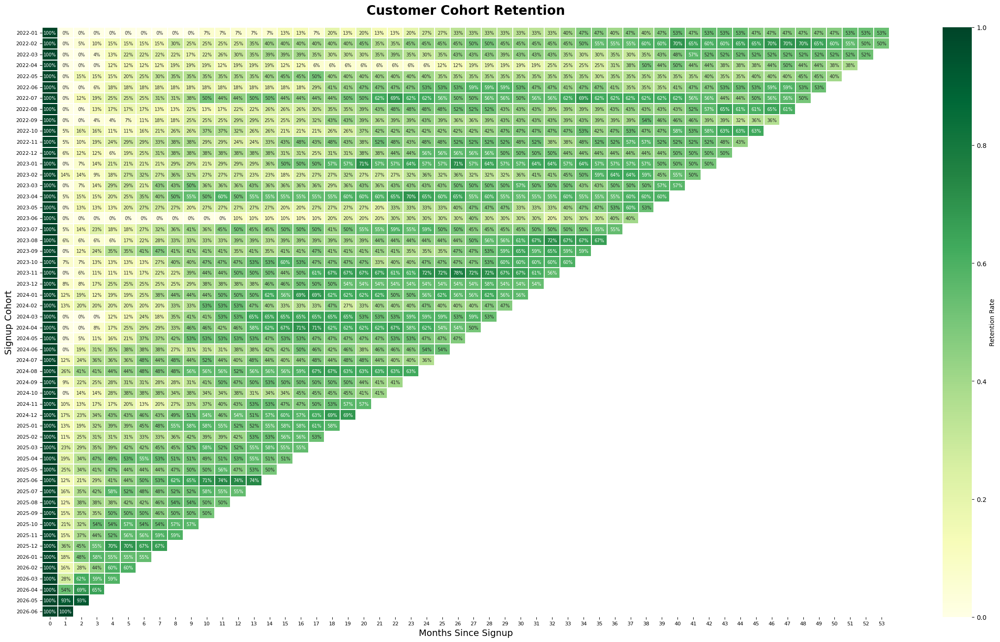

# Cohort Retention Analysis

## Business Question

Is customer retention improving over time, or is overall churn being driven by one or two poorly performing signup cohorts?

---

## Approach

Customer retention was analyzed using a monthly cohort framework.

Each company was assigned to a cohort based on its **signup month**, following the project specification. For every subsequent month after signup, the number of companies with an active subscription at the beginning of that month was calculated and divided by the original cohort size.

### Methodology

1. Assign each account to a monthly signup cohort.
2. Calculate the size of every cohort.
3. Generate monthly snapshots (Month 0, Month 1, Month 2, ...).
4. Mark an account as active if:

   - `start_date <= snapshot_date`
   - `end_date IS NULL OR end_date > snapshot_date`

5. Count distinct active accounts for every cohort-month.
6. Divide by the original cohort size to compute retention percentage.
7. Visualize the results as a cohort retention heatmap.

---

## Cohort Retention Heatmap

---

# Executive Summary

The cohort analysis shows that retention varies across signup cohorts but no single cohort consistently underperforms throughout its lifecycle. Most cohorts experience relatively low retention during the early months, followed by gradual improvement over time.

Unlike a traditional SaaS retention curve, several cohorts display increasing retention percentages in later months. This behaviour is explained by the structure of the underlying dataset rather than an error in the retention calculation.

Overall, there is no evidence that overall churn is being driven by one exceptionally poor cohort. Instead, customer activity fluctuates across cohorts over time.

---

# Key Findings

## 1. No single cohort consistently underperforms

Although some cohorts retain fewer customers during their early lifecycle, retention patterns converge over time. No individual signup cohort remains substantially worse than others across all observation periods.

---

## 2. Retention varies across customer lifecycles

Retention is not monotonic in this dataset. Several cohorts show higher retention rates in later months because customers can become active again through renewed or later subscriptions.

This indicates that customer activity is episodic rather than permanently ending after initial inactivity.

---

## 3. Cohort sizes remain relatively consistent

Most monthly cohorts contain between approximately 15 and 30 companies, making comparisons across cohorts reasonably balanced without one exceptionally large cohort dominating the analysis.

---

## 4. Overall churn is distributed across cohorts

Since multiple cohorts exhibit similar long-term retention behaviour, the analysis suggests that overall churn is broadly distributed rather than originating from one isolated acquisition period.

---

# Business Interpretation

The retention analysis suggests that customer activity fluctuates throughout the customer lifecycle rather than following a simple continuous decline.

From a business perspective, this indicates that many customers return after periods of inactivity through renewed subscriptions or reactivation events. Therefore, improving re-engagement strategies may be as valuable as reducing initial churn.

Because no individual cohort consistently performs worse than others, broad improvements to onboarding, activation, and customer success are likely to produce greater long-term benefits than targeting a single acquisition period.

---

# Dataset Limitation

This analysis intentionally follows the project specification by defining cohorts using **customer signup month**.

During validation of the source data, it was observed that many customers signed up significantly earlier than their first recorded subscription. In several cases, the delay between signup and the first subscription extended to many months or even multiple years.

As a result:

- Early cohort retention appears unusually low because many customers had not yet started a subscription.
- Later retention can increase when those customers eventually become active.
- These patterns reflect the structure of the dataset rather than an error in the cohort calculation.

If the business objective were to measure **subscription retention** rather than **account signup retention**, cohorts would more appropriately be defined using each customer's first subscription start date instead of signup date.

---

# Conclusion

Using signup-month cohorts, the analysis finds no evidence that one or two poorly performing cohorts are responsible for overall churn. Customer retention varies across cohorts, but long-term behaviour is broadly similar.

The observed retention patterns are strongly influenced by the relationship between signup dates and subscription start dates in the dataset. Consequently, the results should be interpreted as **signup cohort retention**, consistent with the project requirements, rather than a conventional SaaS subscription retention analysis.
